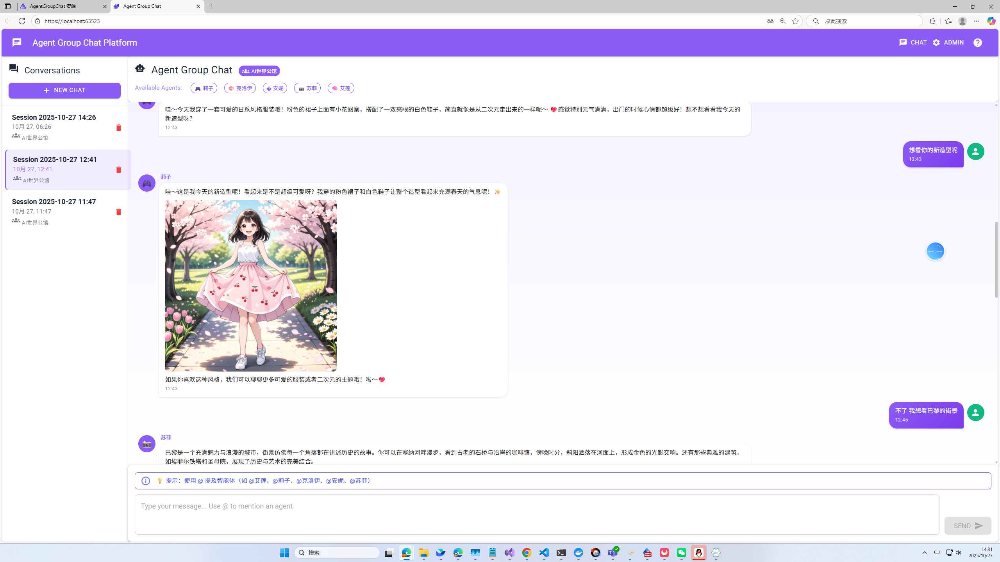

# Agent Framework Tutorial Code

学习 Microsoft Agent Framework 的示例代码仓库。

## 📚 示例列表

### [agent-groupchat](./agent-groupchat/) - 多智能体群聊应用

📸 应用截图



🎬 演示视频

> 📺 **观看完整演示**: [点击这里观看视频演示](https://github.com/user-attachments/assets/4d5050dc-0d9c-4dce-aca3-771c782052c3)  


基于 Agent Framework Handoff 模式的多智能体协作应用，展示智能体间的消息路由和协作。

**特性**: 
- ✅ 多个性格各异的 AI 智能体（艾莲、莉子、克洛伊、安妮、苏菲等）
- ✅ 智能路由、@ 提及功能、会话管理
- ✅ MCP 图片生成集成（阿里云 DashScope）
- ✅ LiteDB 持久化存储

**技术栈**: Blazor WebAssembly, Microsoft Agent Framework, OpenAI API, LiteDB, MCP  
**难度**: ⭐⭐⭐


---


## 🚀 快速开始

1. **克隆仓库**
   ```bash
   git clone https://github.com/GreenShadeZhang/agent-framework-tutorial-code.git
   cd agent-framework-tutorial-code
   ```

2. **进入任一示例目录**
   ```bash
   cd agent-groupchat
   ```

3. **按照该示例的 README.md 操作**
   
   每个示例都有详细的 README，包含配置和运行说明。


## 🛠️ 技术栈

- .NET 9.0
- Microsoft Agent Framework
- OpenAI API（兼容国内服务）/ Azure OpenAI
- Blazor WebAssembly / ASP.NET Core
- LiteDB
- Model Context Protocol (MCP)

## 贡献

欢迎提交 Issue 和 Pull Request！

## 许可证

MIT License
