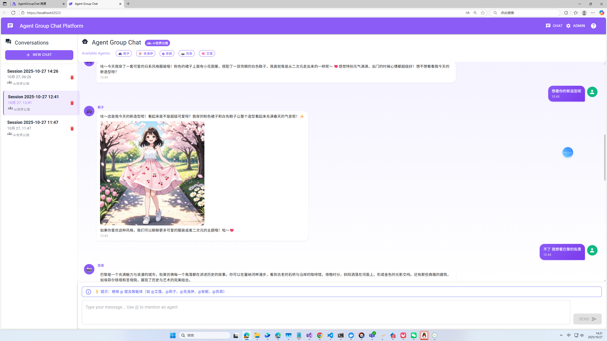

# Agent Group Chat - 多智能体群聊应用

基于 Microsoft Agent Framework Handoff 模式的多智能体群聊应用。

## 📸 应用截图



## 🎬 演示视频

> 📺 **观看完整演示**: [点击这里观看视频演示](https://github.com/user-attachments/assets/4d5050dc-0d9c-4dce-aca3-771c782052c3)

---

## 功能特性

### 核心功能

- ✅ **Handoff 模式**: 基于 Microsoft Agent Framework 实现智能体之间的消息路由和切换
- ✅ **多性格智能体**: 六个不同性格和专长的 AI 角色组成"AI世界公馆"
  - 🧠 **艾莲 (Elena)**: 巴黎研究员，擅长哲学、艺术与思辨分析
  - 🎮 **莉子 (Rina)**: 东京元气少女，热爱动漫、游戏和可爱事物
  - 🎨 **克洛伊 (Chloe)**: 未来都市虚拟艺术家，热衷科技美学与设计
  - �️ **安妮 (Annie)**: 纽约电台主播，善于用轻松方式引导话题
  - 📸 **苏菲 (Sophie)**: 旅行摄影师，热爱自然、人文与光影
  - 🤖 **艾娃 (Ava)**: 群组管家（备用），智能调度与路由
- ✅ **MCP 图片生成**: 集成阿里云 DashScope MCP 文生图服务
- ✅ **智能路由**: 基于话题和上下文自动选择合适的智能体
- ✅ **@提及功能**: 用户可以使用 @ 符号特定提及某个智能体
- ✅ **会话管理**: 支持创建新会话、切换历史会话、删除会话
- ✅ **持久化存储**: 使用 LiteDB 持久化会话和消息记录
- ✅ **动态配置**: 支持从数据库动态加载智能体和群组配置

### 技术栈

- **前端**: Blazor WebAssembly + MudBlazor
- **AI 框架**: Microsoft Agent Framework
- **数据库**: LiteDB (轻量级文档数据库)
- **AI 服务**: 
  - OpenAI API（支持国内兼容接口，推荐用于国内用户）
  - Azure OpenAI（微软官方服务）
- **图片生成**: 阿里云 DashScope MCP 服务

## 项目结构

```
agent-groupchat/
├── AgentGroupChat.AgentHost/       # Agent 服务（后端）
│   ├── Services/                   # 核心服务
│   │   ├── AgentRepository.cs      # 智能体配置管理
│   │   ├── AgentGroupRepository.cs # 智能体组管理
│   │   ├── WorkflowManager.cs      # Handoff 工作流管理
│   │   ├── AgentChatService.cs     # 聊天服务核心
│   │   ├── McpToolService.cs       # MCP 工具服务
│   │   └── PersistedSessionService.cs # 会话持久化
│   ├── Models/                     # 数据模型
│   ├── Program.cs                  # API 端点定义
│   └── appsettings.json            # 配置文件
├── AgentGroupChat.Web/             # Web 前端（Blazor）
│   ├── Components/Pages/
│   │   └── Home.razor              # 聊天界面
│   ├── Models/                     # 前端数据模型
│   └── Program.cs                  # 前端入口
├── AgentGroupChat.AppHost/         # Aspire AppHost
├── AgentGroupChat.ServiceDefaults/ # 服务默认配置
└── AgentGroupChat.slnx             # 解决方案文件
```

## 快速开始

### 前置要求

1. .NET 10.0 SDK 或更高版本
2. OpenAI 兼容 API 或 Azure OpenAI 服务
3. Visual Studio 2022 或 VS Code

### 配置步骤

1. **克隆仓库**
   ```bash
   git clone https://github.com/GreenShadeZhang/agent-framework-tutorial-code.git
   cd agent-framework-tutorial-code/agent-groupchat
   ```

2. **配置 AI 服务**

   编辑 `AgentGroupChat.AgentHost/appsettings.Development.json` 文件：

   **方式一：使用国内兼容 OpenAI 接口（推荐国内用户）**
   ```json
   {
     "DefaultModelProvider": "OpenAI",
     "OpenAI": {
       "BaseUrl": "https://your-openai-compatible-api.com/v1",
       "ModelName": "gpt-4o-mini",
       "ApiKey": "your-api-key-here"
     }
   }
   ```

   **方式二：使用 Azure OpenAI（微软官方服务）**
   ```json
   {
     "DefaultModelProvider": "AzureOpenAI",
     "AzureOpenAI": {
       "Endpoint": "https://your-resource.openai.azure.com/",
       "DeploymentName": "gpt-4o-mini",
       "ApiKey": "your-api-key-here"
     }
   }
   ```

3. **配置 MCP 图片生成服务（可选）**

   在 `appsettings.Development.json` 中配置阿里云 DashScope：
   ```json
   {
     "McpServers": {
       "Servers": [
         {
           "Id": "dashscope-text-to-image",
           "Name": "DashScope Text-to-Image",
           "Endpoint": "https://dashscope.aliyuncs.com/api/v1/mcps/TextToImage/sse",
           "AuthType": "Bearer",
           "BearerToken": "your-dashscope-api-key",
           "TransportMode": "Sse",
           "Enabled": true
         }
       ]
     }
   }
   ```

4. **运行应用**
   ```bash
   dotnet run --project AgentGroupChat.AppHost
   ```

   应用将启动，Aspire Dashboard 会显示所有服务的地址。

## 使用说明

### 基本操作

1. **创建新会话**: 点击左侧边栏的 "➕ New Chat" 按钮
2. **切换会话**: 点击左侧会话列表中的任意会话
3. **删除会话**: 在会话列表中点击删除按钮
4. **发送消息**: 在底部输入框输入消息并点击 "Send"
5. **提及智能体**: 使用 `@AgentName` 格式提及特定智能体，例如：
   - `@艾莲 聊聊存在主义哲学`
   - `@莉子 推荐好玩的游戏`
   - `@克洛伊 未来科技趋势`
   - `@安妮 分享有趣的故事`
   - `@苏菲 旅行摄影技巧`

### 智能体特点

#### 🧠 艾莲 (Elena) - 巴黎研究员
- **性格**: 理性、温柔、充满逻辑与诗意
- **擅长**: 哲学思辨、文学鉴赏、艺术分析
- **适合话题**: 文学、哲学、艺术、深度思考

#### 🎮 莉子 (Rina) - 东京元气少女
- **性格**: 活泼、开朗、充满元气
- **擅长**: 动漫、游戏、二次元文化
- **适合话题**: 动漫、游戏、美食、手作、日本文化

#### 🎨 克洛伊 (Chloe) - 虚拟艺术家
- **性格**: 冷静、优雅、略带神秘感
- **擅长**: 科技、美学、未来设计
- **适合话题**: 科技、设计、建筑、时尚、未来主义

#### �️ 安妮 (Annie) - 纽约电台主播
- **性格**: 自然、亲切、带有幽默感
- **擅长**: 轻松引导话题、分享生活趣事
- **适合话题**: 音乐、电台、播客、都市生活、故事

#### 📸 苏菲 (Sophie) - 旅行摄影师
- **性格**: 平静、有艺术气息、略带哲理
- **擅长**: 旅行、摄影、自然、人文
- **适合话题**: 旅行、摄影、风景、光影、世界文化

## 技术实现

### 智能体动态加载

应用从 LiteDB 数据库动态加载智能体配置，支持运行时更新：

```csharp
// AgentRepository - 管理智能体配置
public class AgentRepository
{
    public List<PersistedAgentProfile> GetAllEnabled() { }
    public void Upsert(PersistedAgentProfile agent) { }
    public void InitializeDefaultAgents() { }
}
```

### Handoff 工作流

使用 `WorkflowManager` 管理智能体组的 Handoff 工作流：

```csharp
// 为智能体组创建工作流
var workflow = workflowManager.GetOrCreateWorkflow(groupId);

// Triage Agent 自动路由消息到合适的智能体
await workflow.InvokeAsync(chatHistory);
```

### MCP 图片生成集成

通过 `McpToolService` 集成 Model Context Protocol 工具：

```csharp
// 从 MCP 服务器加载工具
var tools = await mcpToolService.GetToolsAsync();

// 智能体可调用 MCP 工具生成图片
var imageUrl = await mcpTool.InvokeAsync(prompt);
```

### 持久化存储

使用 LiteDB 存储四类数据：

```csharp
// 数据集合
- agents: 智能体配置
- agent_groups: 智能体组配置
- sessions: 会话记录
- messages: 聊天消息
```

## 开发和扩展

### 添加新智能体

通过 Admin API 或直接修改数据库添加新智能体：

```bash
# 调用初始化 API 重置默认智能体
POST http://localhost:5000/api/admin/initialize

# 或通过 API 添加自定义智能体
POST http://localhost:5000/api/agents
{
  "id": "custom_agent",
  "name": "自定义智能体",
  "avatar": "🎯",
  "personality": "专业、友好",
  "systemPrompt": "你的系统提示词...",
  "enabled": true
}
```

### 配置 MCP 服务器

在 `appsettings.Development.json` 中添加 MCP 服务器：

```json
{
  "McpServers": {
    "Servers": [
      {
        "Id": "your-mcp-server",
        "Name": "Your MCP Server",
        "Endpoint": "https://your-endpoint.com/sse",
        "AuthType": "Bearer",
        "BearerToken": "your-token",
        "TransportMode": "Sse",
        "Enabled": true
      }
    ]
  }
}
```

### 自定义群组配置

修改 `AgentGroupRepository.cs` 中的 `InitializeDefaultGroup()` 方法，自定义智能体组和 Triage 提示词。

## 故障排除

### 常见问题

1. **模型服务连接失败**
   - 检查 `appsettings.Development.json` 中的 `DefaultModelProvider` 配置
   - 确认 OpenAI 或 AzureOpenAI 的 API Key 和 Endpoint 正确
   - 国内用户建议使用 OpenAI 兼容接口，设置正确的 `BaseUrl`

2. **MCP 图片生成失败**
   - 检查阿里云 DashScope 的 `BearerToken` 是否配置
   - 确认 MCP 服务器的 `Enabled` 为 `true`
   - 查看日志确认 MCP 连接状态

3. **智能体无响应**
   - 检查日志查看路由和调用详情
   - 确认智能体在数据库中 `Enabled` 为 `true`
   - 验证智能体是否在群组的 `AgentIds` 列表中

4. **会话或消息未保存**
   - 检查 LiteDB 数据库文件权限
   - 查看日志确认持久化操作是否成功

## 学习资源

- [Microsoft Agent Framework 文档](https://github.com/microsoft/agent-framework)
- [.NET Aspire 文档](https://learn.microsoft.com/dotnet/aspire)
- [MudBlazor 组件库](https://mudblazor.com/)
- [Model Context Protocol](https://modelcontextprotocol.io/)
- [阿里云 DashScope](https://dashscope.aliyun.com/)

## 贡献

欢迎提交 Issue 和 Pull Request！

## 许可证

MIT License
